# Image skill

[中文](README.md) | English

Image skill is a collection of original visual Skills for Codex, WorkBuddy, and compatible agents. Each Skill reads source evidence, chooses one governing visual mechanism, and produces a clean, art-directed result with honest boundaries.

## Start here: using the Skills

Read [`docs/USAGE.en.md`](docs/USAGE.en.md) first. It explains how beginners can import and call these Skills in Codex, WorkBuddy / Workbuddy, and other agents that support custom Skill folders or Markdown instructions, including platform ratios and `test` / `accepted` delivery states.

Shortest call:

```text
Use $graphic-composition-poster.
Make a native 3:4 Xiaohongshu poster, preserve the subject identity, and return a test first.
```

中文 guide: [`docs/USAGE.md`](docs/USAGE.md).

## What this is

This is not a filter pack and not a one-style template. Every Skill has a distinct visual responsibility, reset rule, and delivery boundary:

`source evidence → visual thesis → one governing mechanism → art direction → clean output`

The same source can take different paths, but it is never forced into one template. The system prioritizes readable subjects, a clear visual axis, exact type, clean masters, and an honest distinction between `test` and `accepted` work.

## Release scope

### Our Original Skills

| Skill | Responsibility |
| --- | --- |
| [`cinematic-key-art-poster`](skills/cinematic-key-art-poster/) | Film key art, narrative promise, and campaign image |
| [`graphic-composition-poster`](skills/graphic-composition-poster/) | Crop, grid, colour territory, and type/image composition |
| [`impossible-space-editorial-poster`](skills/impossible-space-editorial-poster/) | Spatial contradiction, scale, and editorial poster logic |
| [`music-album-cover-art`](skills/music-album-cover-art/) | Record identity and portable editable cover delivery |
| [`optical-refraction-visual`](skills/optical-refraction-visual/) | Physically legible refraction, reflection, and transparent media |
| [`symbolic-narrative-poster`](skills/symbolic-narrative-poster/) | One visual metaphor and semantic transformation |
| [`page-flip-showcase`](skills/page-flip-showcase/) | Editorial static page-turn showcase with source protection |
| [`y2k-street-cutout-poster`](skills/y2k-street-cutout-poster/) | Y2K street-magazine collage |

### Original visual languages

| Skill | Responsibility |
| --- | --- |
| [`high-chroma-screenprint-poster`](skills/high-chroma-screenprint-poster/) | Limited-ink screenprint planes and registration |
| [`kinetic-contour-field-poster`](skills/kinetic-contour-field-poster/) | Contours driven by a real force in the source |
| [`layered-paper-relief-poster`](skills/layered-paper-relief-poster/) | Layered cut-paper relief and shallow depth |
| [`mineral-shadow-reliquary-poster`](skills/mineral-shadow-reliquary-poster/) | Dark mineral relief and one motivated luminous event |
| [`mixed-media-photo-collage-poster`](skills/mixed-media-photo-collage-poster/) | Truthful photo anchor and printed extension |
| [`vintage-offset-cinema-poster`](skills/vintage-offset-cinema-poster/) | Mid-century offset narrative poster logic |

## Examples

Each of the 14 Skills has a primary example, with one additional Y2K variant. Click a Skill name for its instructions.

| | |
| --- | --- |
| [Film key art · TWO DIRECTIONS](skills/cinematic-key-art-poster/)<br>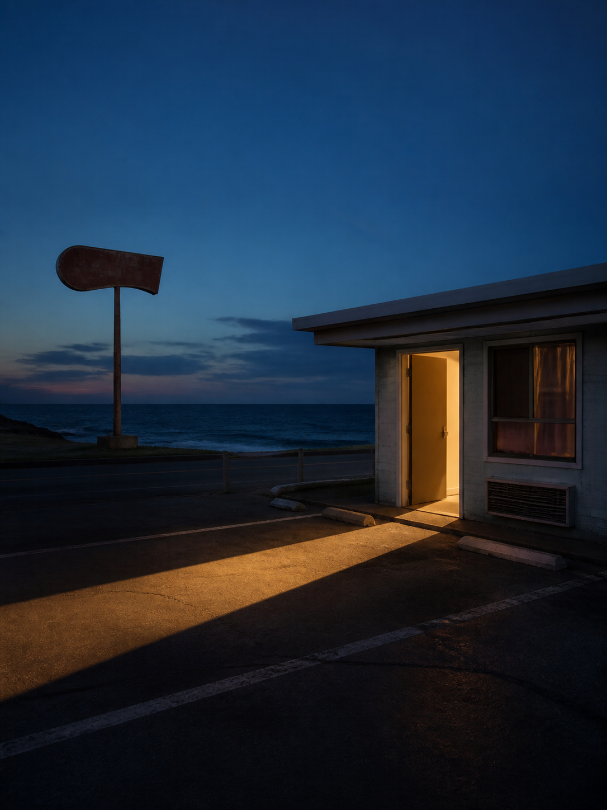 | [Graphic composition · NO DATE](skills/graphic-composition-poster/)<br>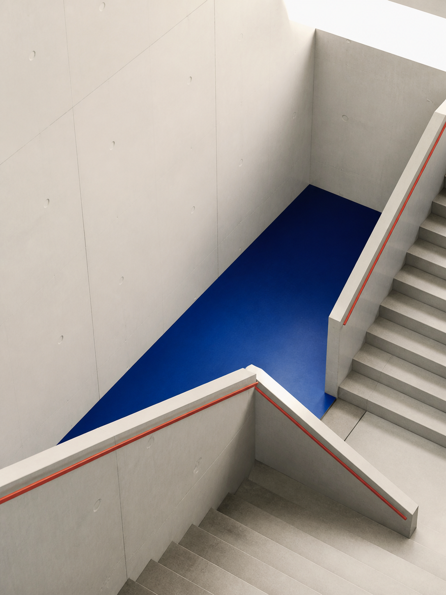 |
| [Impossible space · FAULT LINE](skills/impossible-space-editorial-poster/)<br>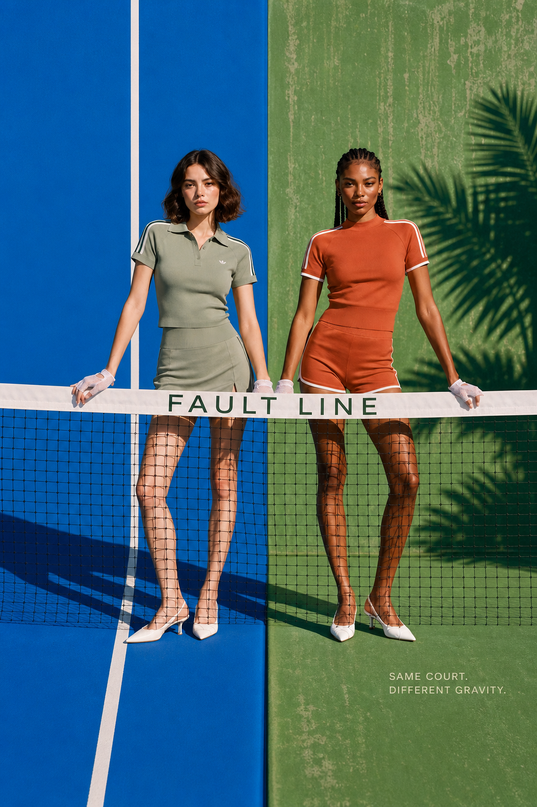 | [Album cover · DETOUR](skills/music-album-cover-art/)<br>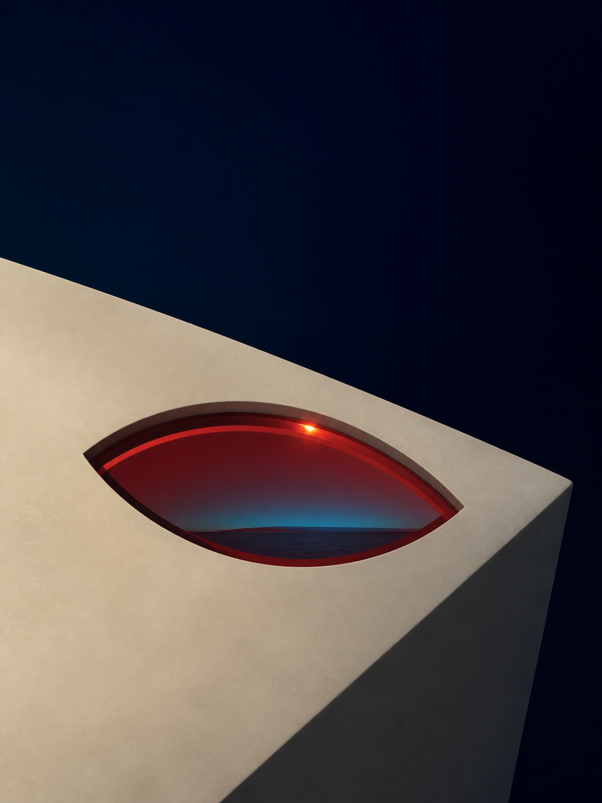 |
| [Symbolic narrative · THE GAP](skills/symbolic-narrative-poster/)<br> | [Y2K · RED SIGNAL](skills/y2k-street-cutout-poster/)<br>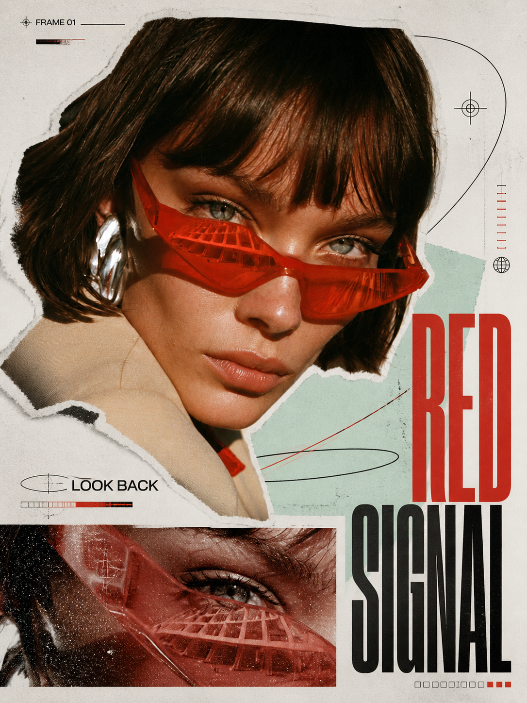 |
| [High-chroma screenprint](skills/high-chroma-screenprint-poster/)<br>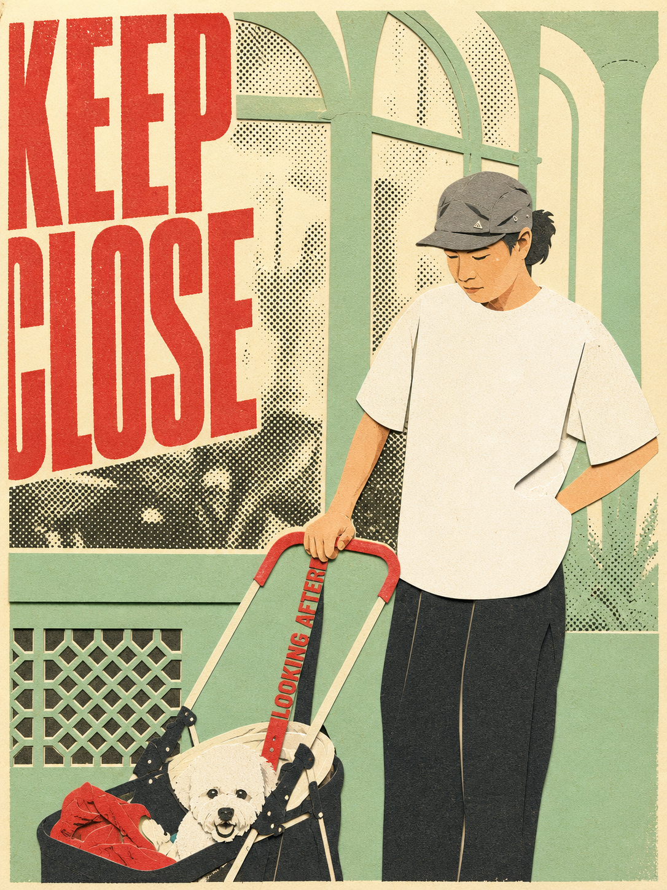 | [Kinetic contour field](skills/kinetic-contour-field-poster/)<br>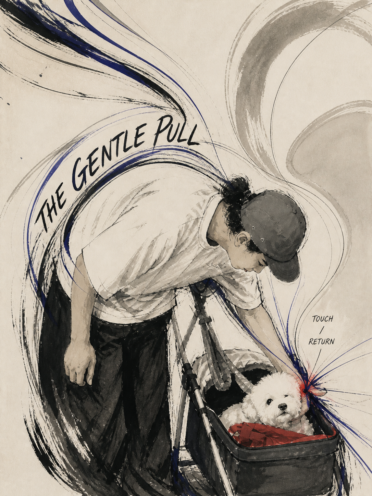 |
| [Layered paper relief](skills/layered-paper-relief-poster/)<br>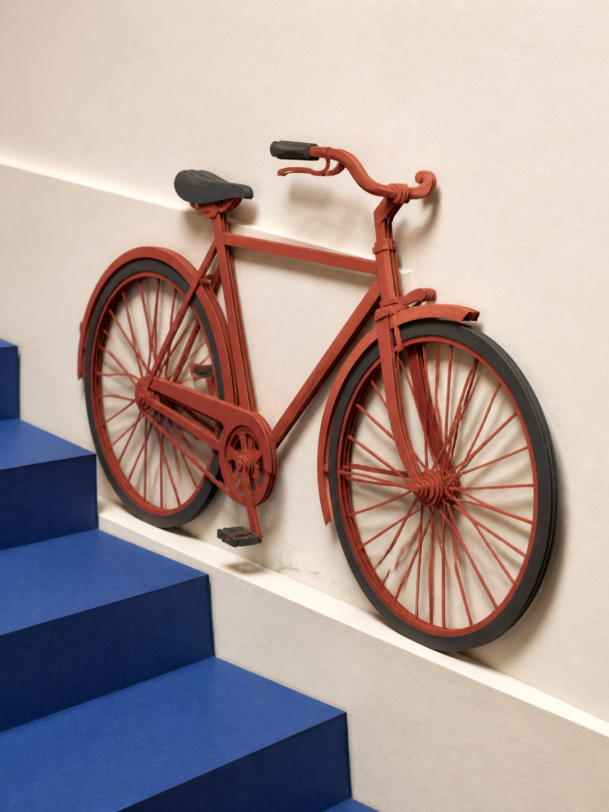 | [Mineral shadow reliquary](skills/mineral-shadow-reliquary-poster/)<br>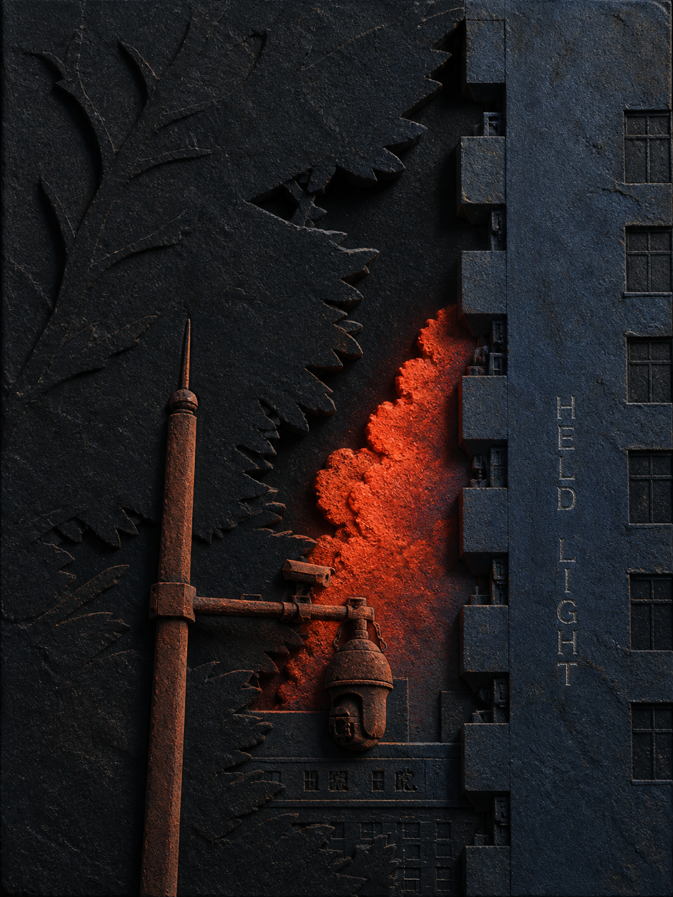 |
| [Mixed-media photo collage](skills/mixed-media-photo-collage-poster/)<br>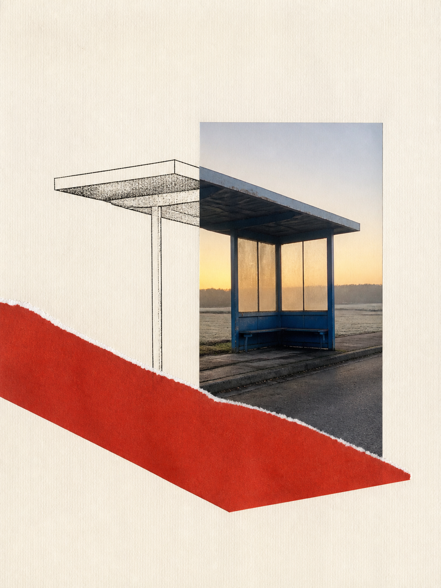 | [Optical refraction](skills/optical-refraction-visual/)<br>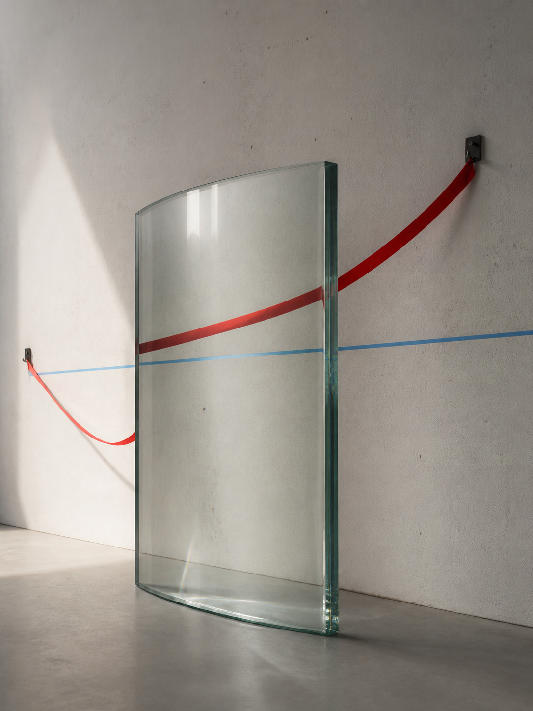 |
| [Vintage offset cinema](skills/vintage-offset-cinema-poster/)<br>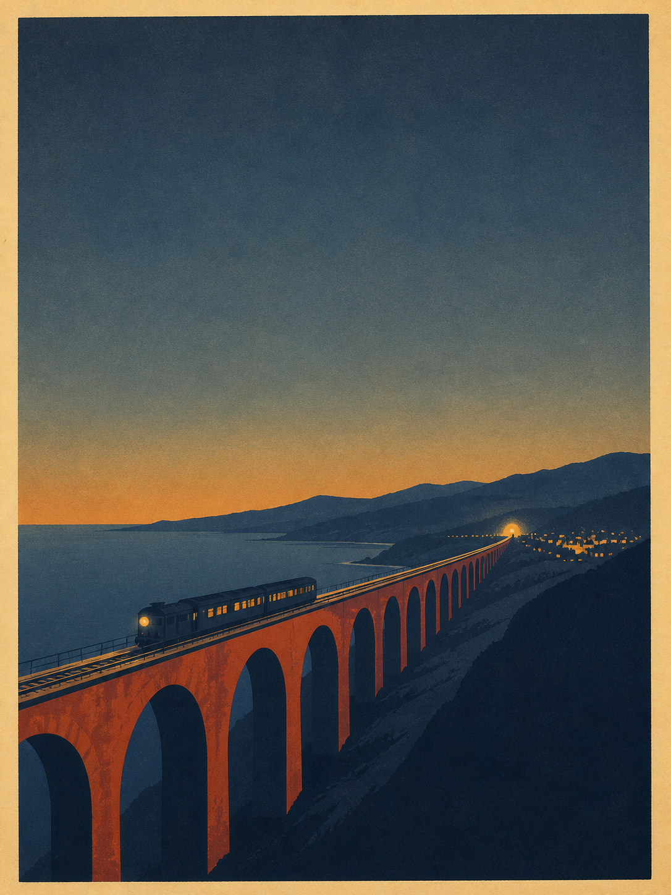 | [Static page-flip showcase](skills/page-flip-showcase/)<br>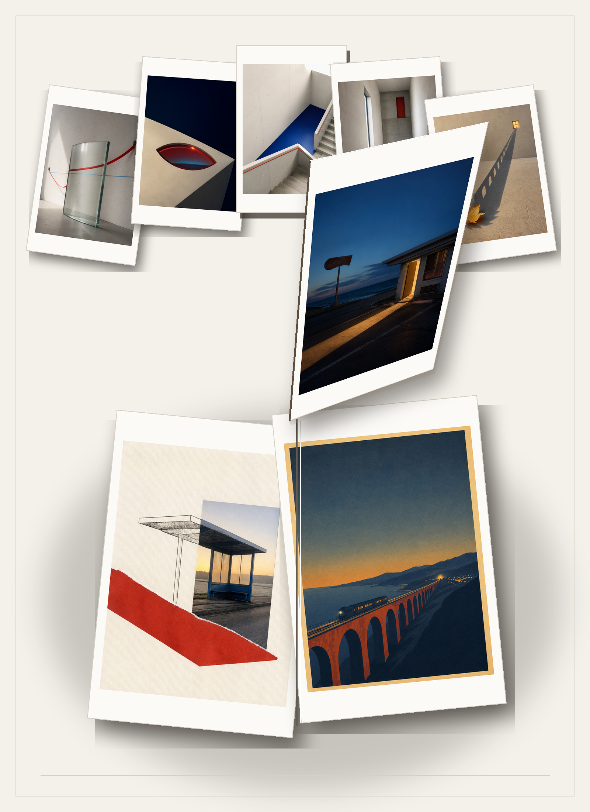 |

Y2K · URBAN SIGNAL（变体 / variant）

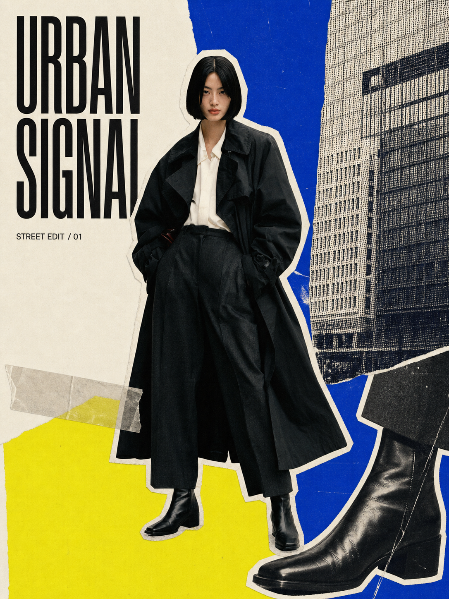

See the [complete gallery](examples/README.md). RED SIGNAL and URBAN SIGNAL are the maintainer's supplied Skill outputs, preserved unchanged.

## Installation

Clone the repository and copy the Skill you need into your Codex Skills directory:

```bash
git clone https://github.com/Mariposa-FLOA/image-skill.git
mkdir -p ~/.codex/skills
cp -R image-skill/skills/cinematic-key-art-poster ~/.codex/skills/
```

To copy every Skill in this release:

```bash
for skill in image-skill/skills/*; do
  cp -R "$skill" ~/.codex/skills/
done
```

Restart Codex after installation. Each directory's `SKILL.md` is the source of truth for its workflow and output contract.

These are model-agnostic Markdown workflows. For a permanent install, copy skills/<skill-name>/; for a one-off chat, download one .md file from [chat-ready/](chat-ready/) and drop it into Codex, Doubao, WorkBuddy, or another agent that accepts attachments. The agent then calls Image 2, Seedream, or another image-generation model.

See [docs/CHAT-DROP.md](docs/CHAT-DROP.md) for the full handoff sentence.

## Find the author

Author: `AIGC-泷`

Unified Douyin and other-platform username: `AIGC-泷`. Search this name on your usual platform to find the author and future work.

If you share this repository publicly, attribution is welcome: `Image Skill by @AIGC-泷`

## Collaboration

- `AIGC-泷`: author and maintainer
- `Codex`: AI collaborator for Skill packaging, example completion, cross-agent usage docs, and release validation

GitHub's Contributors graph is generated from commit identities; this section records the actual human–AI collaboration behind the project.

## Licensing

- `SKILL.md`, design methods, and documentation: [CC BY-NC 4.0](https://creativecommons.org/licenses/by-nc/4.0/).
- Program code under `scripts/`: Apache-2.0, see [`LICENSE-CODE`](LICENSE-CODE).
- Demonstration images under `examples/`: see [`EXAMPLES-LICENSE.md`](EXAMPLES-LICENSE.md).
- Attribution, provenance, and exclusions: [`NOTICE.md`](NOTICE.md) and [`THIRD_PARTY.md`](THIRD_PARTY.md).

## Version

Current public version: `v1.0.3`.

Formal Release: [v1.0.3](https://github.com/Mariposa-FLOA/image-skill/releases/tag/v1.0.3).
