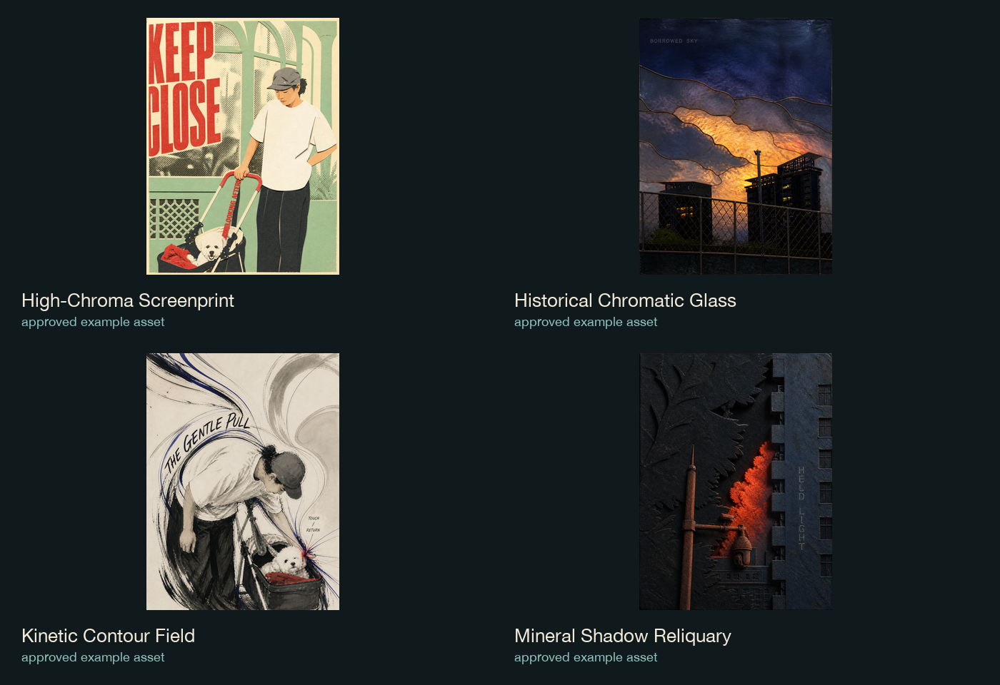

# Our Original Visual Skills

[中文](README.md) | English

A collection of original visual Skills for Codex. Each Skill reads the source evidence, chooses one governing visual mechanism, and produces a clean, art-directed result with honest boundaries.

> **Release boundary:** this repository contains only Skills we designed and independently packaged. External starter Skills, distilled adaptations, and third-party repositories are excluded.

## Start here: using the Skills

Read [`docs/USAGE.en.md`](docs/USAGE.en.md) first. It explains how beginners can import and call these Skills in Codex, WorkBuddy / Workbuddy, and other agents that support custom Skill folders or Markdown instructions, including platform ratios and `test` / `accepted` delivery states.

Shortest call:

```text
Use $graphic-composition-poster.
Make a native 3:4 Xiaohongshu poster, preserve the subject identity, and return a test first.
```

中文 guide: [`docs/USAGE.md`](docs/USAGE.md).

## What this is

This is not a filter pack and not a one-style template. Every Skill has a distinct visual responsibility, reset rule, and delivery boundary:

`source evidence → visual thesis → one governing mechanism → art direction → clean output`

The same source can take different paths, but it is never forced into one template. The system prioritizes readable subjects, a clear visual axis, exact type, clean masters, and an honest distinction between `test` and `accepted` work.

## Release scope

### Our Original Skills

| Skill | Responsibility |
| --- | --- |
| [`cinematic-key-art-poster`](skills/cinematic-key-art-poster/) | Film key art, narrative promise, and campaign image |
| [`graphic-composition-poster`](skills/graphic-composition-poster/) | Crop, grid, colour territory, and type/image composition |
| [`impossible-space-editorial-poster`](skills/impossible-space-editorial-poster/) | Spatial contradiction, scale, and editorial poster logic |
| [`music-album-cover-art`](skills/music-album-cover-art/) | Record identity and portable editable cover delivery |
| [`optical-refraction-visual`](skills/optical-refraction-visual/) | Physically legible refraction, reflection, and transparent media |
| [`symbolic-narrative-poster`](skills/symbolic-narrative-poster/) | One visual metaphor and semantic transformation |
| [`page-flip-showcase`](skills/page-flip-showcase/) | Editorial static page-turn showcase with source protection |
| [`y2k-street-cutout-poster`](skills/y2k-street-cutout-poster/) | Y2K street-magazine collage |

### Original visual languages

| Skill | Responsibility |
| --- | --- |
| [`high-chroma-screenprint-poster`](skills/high-chroma-screenprint-poster/) | Limited-ink screenprint planes and registration |
| [`kinetic-contour-field-poster`](skills/kinetic-contour-field-poster/) | Contours driven by a real force in the source |
| [`layered-paper-relief-poster`](skills/layered-paper-relief-poster/) | Layered cut-paper relief and shallow depth |
| [`mineral-shadow-reliquary-poster`](skills/mineral-shadow-reliquary-poster/) | Dark mineral relief and one motivated luminous event |
| [`mixed-media-photo-collage-poster`](skills/mixed-media-photo-collage-poster/) | Truthful photo anchor and printed extension |
| [`vintage-offset-cinema-poster`](skills/vintage-offset-cinema-poster/) | Mid-century offset narrative poster logic |

> `stained-glass-mosaic-poster` is retired and appears only as a historical visual example, not as an installable Skill.

## Examples

The release includes historical image assets explicitly marked as approved by the maintainer plus new project-generated examples created without personal source material. Unapproved archive images are not copied or substituted.



See [`examples/README.md`](examples/README.md) for the image index and provenance notes. Approved assets currently included:

- `high-chroma-screenprint-poster.png`
- `kinetic-contour-field-poster.png`
- `mineral-shadow-reliquary-poster.png`
- `historical-chromatic-glass-mosaic.png` (historical/retired visual language)

Project-generated completion examples include `page-flip-showcase.png` and the other current Skill assets. The Y2K example uses the two references explicitly supplied by the maintainer; raw references remain outside the repository.

All installable Skills have a named example file in `examples/`; raw inputs and unapproved process images remain outside the repository.

See [`docs/SCOPE-MATRIX.md`](docs/SCOPE-MATRIX.md) for the complete inclusion, exclusion, and example-status matrix.

## Installation

Clone the repository and copy the Skill you need into your Codex Skills directory:

```bash
git clone https://github.com/dujiaxi2359-cloud/our-original-visual-skills.git
mkdir -p ~/.codex/skills
cp -R our-original-visual-skills/skills/cinematic-key-art-poster ~/.codex/skills/
```

To copy every Skill in this release:

```bash
for skill in our-original-visual-skills/skills/*; do
  cp -R "$skill" ~/.codex/skills/
done
```

Restart Codex after installation. Each directory's `SKILL.md` is the source of truth for its workflow and output contract.

## WeChat group

The WeChat group location is reserved. The QR code is intentionally omitted from this Release and can be added in a later version after the maintainer supplies and approves it. We do not invent a group number or publish private chat screenshots as a QR code.

Reserved location: [`assets/community/`](assets/community/).

## Licensing

- `SKILL.md`, design methods, and documentation: [CC BY-NC 4.0](https://creativecommons.org/licenses/by-nc/4.0/).
- Program code under `scripts/`: Apache-2.0, see [`LICENSE-CODE`](LICENSE-CODE).
- Demonstration images under `examples/`: see [`EXAMPLES-LICENSE.md`](EXAMPLES-LICENSE.md).
- Attribution, provenance, and exclusions: [`NOTICE.md`](NOTICE.md) and [`THIRD_PARTY.md`](THIRD_PARTY.md).

## Version

Local release candidate: `v1.0.0-rc2`. The QR code is intentionally omitted from this Release and can be added in a later version.
