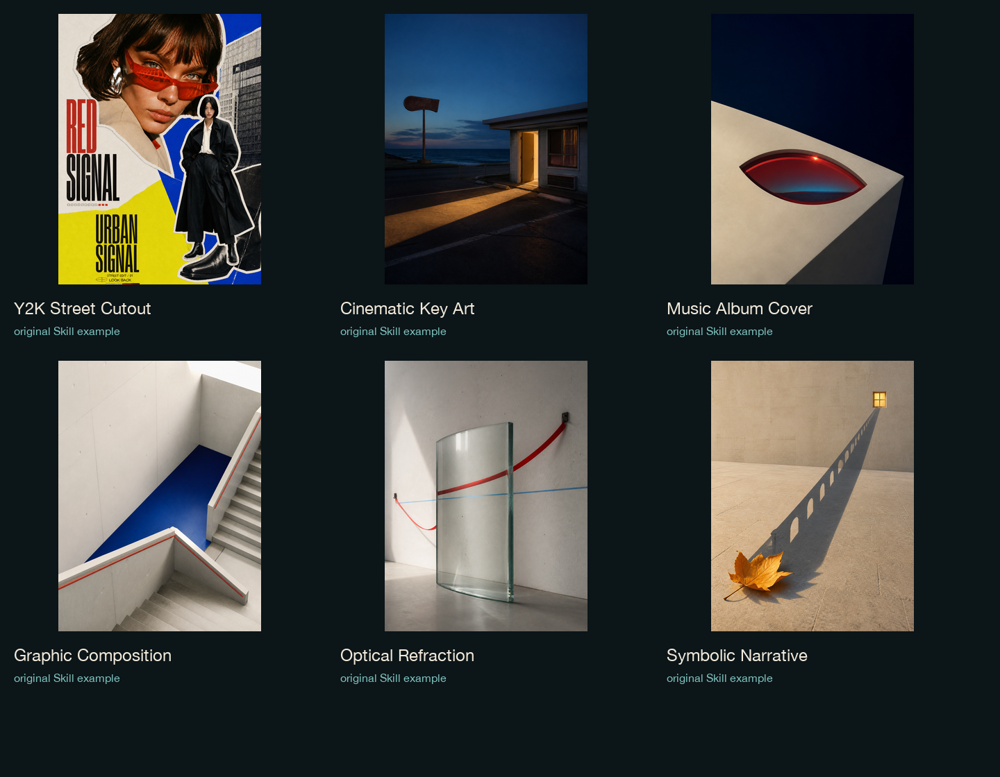

# Image skill

中文 | [English](README.en.md)

Image skill 是一组为 Codex、WorkBuddy 和其他智能体编写的原创视觉 Skill：先读懂图像中的事实、关系和情绪，再选择构图机制、媒介语言、色彩与文字行为。

> **发布边界**：本仓库只收录我们自主建立或独立封装的原创 Skill。外部初始 Skill、蒸馏加强 Skill 和第三方仓库不会混入。

## 先看：怎么使用

第一次使用时，先看 [`docs/USAGE.md`](docs/USAGE.md)。它用新手能直接照做的方式说明 Codex、WorkBuddy / Workbuddy 和其他支持自定义 Skill 的智能体如何导入、选择、调用，以及如何写清楚平台比例、保留项和 `test` / `accepted` 状态。

最短调用方式：

```text
请使用 $graphic-composition-poster。
做一张小红书 3:4 原生海报，保留主体身份，先给 test，不要自动归档。
```

English guide: [`docs/USAGE.en.md`](docs/USAGE.en.md)。

## 这是什么

这不是一个滤镜包，也不是把所有照片套成同一种风格。每个 Skill 都有自己的视觉职责、失败重置规则和输出边界：

`source evidence → visual thesis → one governing mechanism → art direction → clean output`

同一张图可以进入不同的视觉路径，但不会被同一个模板强行处理。默认优先保证人物/物体可读、构图有明确主轴、文字准确、画面干净，并区分 `test` 与 `accepted`。

## 当前发布范围

### 我们的原创 Skill · 自主原创

| Skill | 视觉职责 |
| --- | --- |
| [`cinematic-key-art-poster`](skills/cinematic-key-art-poster/) | 电影主视觉、叙事命题与 campaign image |
| [`graphic-composition-poster`](skills/graphic-composition-poster/) | 平面构成、裁切、网格、色域与字体关系 |
| [`impossible-space-editorial-poster`](skills/impossible-space-editorial-poster/) | 空间错层、视点矛盾与编辑海报 |
| [`music-album-cover-art`](skills/music-album-cover-art/) | 专辑封面、发行身份与可编辑分层交付 |
| [`optical-refraction-visual`](skills/optical-refraction-visual/) | 有物理依据的折射、镜面与透明介质 |
| [`symbolic-narrative-poster`](skills/symbolic-narrative-poster/) | 单一视觉隐喻与语义变形 |
| [`page-flip-showcase`](skills/page-flip-showcase/) | 编辑式静态翻页展示与源图保护 |
| [`y2k-street-cutout-poster`](skills/y2k-street-cutout-poster/) | Y2K 街头杂志拼贴 |

### 我们的原创视觉语言 · 独立封装

| Skill | 视觉职责 |
| --- | --- |
| [`high-chroma-screenprint-poster`](skills/high-chroma-screenprint-poster/) | 限色丝网版画、色块与套印逻辑 |
| [`kinetic-contour-field-poster`](skills/kinetic-contour-field-poster/) | 由真实动作/注意力驱动的轮廓场 |
| [`layered-paper-relief-poster`](skills/layered-paper-relief-poster/) | 多层纸雕剪纸与浅浮雕结构 |
| [`mineral-shadow-reliquary-poster`](skills/mineral-shadow-reliquary-poster/) | 暗色矿物浮雕与单一发光事件 |
| [`mixed-media-photo-collage-poster`](skills/mixed-media-photo-collage-poster/) | 真实照片锚点、印刷延展与拼贴结构 |
| [`vintage-offset-cinema-poster`](skills/vintage-offset-cinema-poster/) | 复古胶印电影叙事与限色套印 |

> `stained-glass-mosaic-poster` 已退役，只在下方作为历史示例展示，不作为可安装 Skill。

## 示例图

本次公开示例图分为两类：维护者明确标记为可用的红框素材，以及为补齐 Skill 展示而新生成的、无个人原始素材的项目示例。没有得到授权的旧图不会被复制进仓库，也不会用其他未标记图片替代。



详细图档与来源说明见 [`examples/README.md`](examples/README.md)。红框批准的历史素材：

- `high-chroma-screenprint-poster.png`
- `kinetic-contour-field-poster.png`
- `mineral-shadow-reliquary-poster.png`
- `historical-chromatic-glass-mosaic.png`（历史/退役视觉，不对应当前可安装 Skill）

项目生成的补齐示例包括 `page-flip-showcase.png` 以及其他当前 Skill 对应图。Y2K 示例按维护者要求使用两张指定参考图生成，原始参考图不进入仓库。

这样不会把原始输入文件或未获授权的过程图带入公开仓库。

完整的纳入/排除与示例状态见 [`docs/SCOPE-MATRIX.md`](docs/SCOPE-MATRIX.md)。

## 安装

克隆仓库后，把需要的 Skill 复制到 Codex Skills 目录：

```bash
git clone https://github.com/dujiaxi2359-cloud/image-skill.git
mkdir -p ~/.codex/skills
cp -R image-skill/skills/cinematic-key-art-poster ~/.codex/skills/
```

也可以复制全部本次发布的 Skill：

```bash
for skill in image-skill/skills/*; do
  cp -R "$skill" ~/.codex/skills/
done
```

重启 Codex 后即可使用，例如：

```text
Use $symbolic-narrative-poster to turn this photo into one clear visual sentence.
```

每个 Skill 的具体边界、输出契约和保存规则以对应目录中的 `SKILL.md` 为准。

## 找到作者

作者：`AIGC-泷`

抖音及其他内容平台统一用户名：`AIGC-泷`。在你常用的平台搜索这个名字，即可找到作者与后续作品。

若公开分享，欢迎标注：`Image Skill by @AIGC-泷`

## 微信群

微信群入口已预留；二维码暂不放入本次 Release，后续可在维护者提供并确认后作为新版本补入。公开仓库不会编造群号，也不会把私人聊天截图当作二维码。

预留位置：[`assets/community/`](assets/community/)。

## 许可证

- `SKILL.md`、设计方法和文档： [CC BY-NC 4.0](https://creativecommons.org/licenses/by-nc/4.0/)。
- `scripts/` 下的程序代码：见 [`LICENSE-CODE`](LICENSE-CODE)，采用 Apache-2.0。
- `examples/` 下的示例图片：见 [`EXAMPLES-LICENSE.md`](EXAMPLES-LICENSE.md)，仅作展示，不随文档许可证开放转售、再发布或训练使用。
- 署名、来源和排除项：见 [`NOTICE.md`](NOTICE.md) 与 [`THIRD_PARTY.md`](THIRD_PARTY.md)。

## 版本

当前公开版本：`v1.0.1`。二维码暂不放入本次 Release，后续可在新版本补入。

正式 Release：[v1.0.1](https://github.com/dujiaxi2359-cloud/image-skill/releases/tag/v1.0.1)。

## 目录

```text
image-skill/
├── README.md
├── README.en.md
├── LICENSE
├── LICENSE-CODE
├── EXAMPLES-LICENSE.md
├── NOTICE.md
├── THIRD_PARTY.md
├── CHANGELOG.md
├── VERSION
├── assets/
│   ├── brand/
│   └── community/
├── examples/
├── skills/
│   ├── cinematic-key-art-poster/
│   ├── graphic-composition-poster/
│   ├── high-chroma-screenprint-poster/
│   ├── impossible-space-editorial-poster/
│   ├── kinetic-contour-field-poster/
│   ├── layered-paper-relief-poster/
│   ├── mineral-shadow-reliquary-poster/
│   ├── mixed-media-photo-collage-poster/
│   ├── music-album-cover-art/
│   ├── optical-refraction-visual/
│   ├── page-flip-showcase/
│   ├── symbolic-narrative-poster/
│   ├── vintage-offset-cinema-poster/
│   └── y2k-street-cutout-poster/
└── docs/
    ├── USAGE.md
    └── USAGE.en.md
```

## 维护者说明

本仓库的目标是把可复用的方法公开得清楚，同时不扩大原始素材的授权边界。公开 Skill 不代表公开用户上传的原图、私人信息或任何未确认的商业授权。
