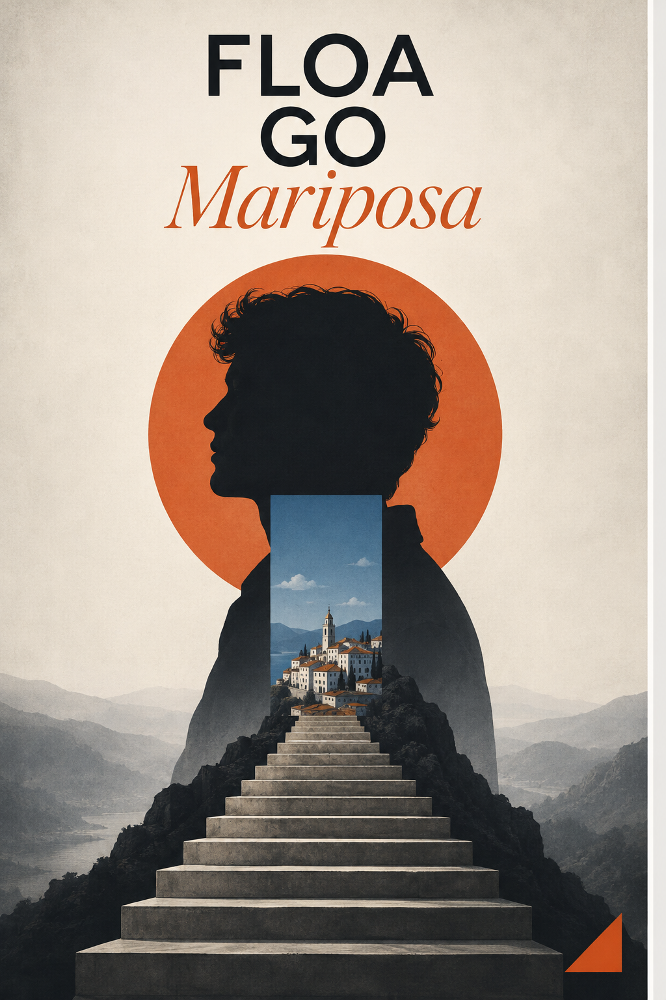

# Image skill

中文 | [English](README.en.md)

Image skill 是一组为 Codex、WorkBuddy 和其他智能体编写的原创视觉 Skill：先读懂图像中的事实、关系和情绪，再选择构图机制、媒介语言、色彩与文字行为。

新增品牌 Skill：[`floa-mariposa-visual-system`](skills/floa-mariposa-visual-system/)。它专门服务产品 `FLOA Mariposa`，正式风格名为“新编辑主义视觉”，不是泛用复古风格。详见 [`docs/FLOA-MARIPOSA-VISUAL-SYSTEM.md`](docs/FLOA-MARIPOSA-VISUAL-SYSTEM.md)。

新增制作工具：[`poster-layered-psd-export`](skills/poster-layered-psd-export/)，用于把真实分层海报导出为 Photoshop PSD，详见 [`docs/LAYERED-PSD-EXPORT.md`](docs/LAYERED-PSD-EXPORT.md)。

## 先看：怎么使用

第一次使用时，先看 [`docs/USAGE.md`](docs/USAGE.md)。它用新手能直接照做的方式说明 Codex、WorkBuddy / Workbuddy 和其他支持自定义 Skill 的智能体如何导入、选择、调用，以及如何写清楚平台比例、保留项和 `test` / `accepted` 状态。

最短调用方式：

```text
请使用 $graphic-composition-poster。
做一张小红书 3:4 原生海报，保留主体身份，先给 test，不要自动归档。
```

English guide: [`docs/USAGE.en.md`](docs/USAGE.en.md)。

## 这是什么

这不是一个滤镜包，也不是把所有照片套成同一种风格。每个 Skill 都有自己的视觉职责、失败重置规则和输出边界：

`source evidence → visual thesis → one governing mechanism → art direction → clean output`

同一张图可以进入不同的视觉路径，但不会被同一个模板强行处理。默认优先保证人物/物体可读、构图有明确主轴、文字准确、画面干净，并区分 `test` 与 `accepted`。

## 当前发布范围

### 新增品牌 Skill · FLOA Mariposa（Unreleased）

| Skill | 视觉职责 |
| --- | --- |
| [`floa-mariposa-visual-system`](skills/floa-mariposa-visual-system/) · [详细说明](docs/FLOA-MARIPOSA-VISUAL-SYSTEM.md) · [单文件投喂](chat-ready/floa-mariposa-visual-system.md) | FLOA Mariposa 产品专属的新编辑主义品牌视觉系统 |

公开示例：

[FLOA Mariposa 新编辑主义视觉](examples/floa-mariposa-visual-system.png)<br>

### 新增制作工具 · Photoshop PSD 分层（Unreleased）

[`poster-layered-psd-export`](skills/poster-layered-psd-export/) · [功能说明](docs/LAYERED-PSD-EXPORT.md)：将真实的全画布 RGBA 图层、透明度、混合模式、中文图层名和合并预览写入 PSD，并输出可编辑性清单。

### 我们的原创 Skill · 自主原创

| Skill | 视觉职责 |
| --- | --- |
| [`cinematic-key-art-poster`](skills/cinematic-key-art-poster/) | 电影主视觉、叙事命题与 campaign image |
| [`graphic-composition-poster`](skills/graphic-composition-poster/) | 平面构成、裁切、网格、色域与字体关系 |
| [`impossible-space-editorial-poster`](skills/impossible-space-editorial-poster/) | 空间错层、视点矛盾与编辑海报 |
| [`music-album-cover-art`](skills/music-album-cover-art/) | 专辑封面、发行身份与可编辑分层交付 |
| [`optical-refraction-visual`](skills/optical-refraction-visual/) | 有物理依据的折射、镜面与透明介质 |
| [`symbolic-narrative-poster`](skills/symbolic-narrative-poster/) | 单一视觉隐喻与语义变形 |
| [`page-flip-showcase`](skills/page-flip-showcase/) · [详细功能说明](docs/PAGE-FLIP-SHOWCASE.md) · [单文件投喂](chat-ready/page-flip-showcase.md) | 静态展示、可点击逐页翻页、MP4 翻页，以及按海报分析生成的自适应拼贴背景 |
| [`y2k-street-cutout-poster`](skills/y2k-street-cutout-poster/) | Y2K 街头杂志拼贴 |

### 我们的原创视觉语言 · 独立封装

| Skill | 视觉职责 |
| --- | --- |
| [`high-chroma-screenprint-poster`](skills/high-chroma-screenprint-poster/) | 限色丝网版画、色块与套印逻辑 |
| [`kinetic-contour-field-poster`](skills/kinetic-contour-field-poster/) | 由真实动作/注意力驱动的轮廓场 |
| [`layered-paper-relief-poster`](skills/layered-paper-relief-poster/) | 多层纸雕剪纸与浅浮雕结构 |
| [`mineral-shadow-reliquary-poster`](skills/mineral-shadow-reliquary-poster/) | 暗色矿物浮雕与单一发光事件 |
| [`mixed-media-photo-collage-poster`](skills/mixed-media-photo-collage-poster/) | 真实照片锚点、印刷延展与拼贴结构 |
| [`vintage-offset-cinema-poster`](skills/vintage-offset-cinema-poster/) | 复古胶印电影叙事与限色套印 |

## 示例图

下面是 v1.0.4 发布集的 14 张主示例图，Y2K 另附一张变体；FLOA Mariposa 另附 1 张维护者授权的公开示例。其余原始样本不复制进公开示例目录。你可以点击技能名称查看使用说明。

| | |
| --- | --- |
| [电影主视觉 · TWO DIRECTIONS](skills/cinematic-key-art-poster/)<br> | [平面构成 · NO DATE](skills/graphic-composition-poster/)<br> |
| [错层空间 · FAULT LINE](skills/impossible-space-editorial-poster/)<br> | [专辑封面 · DETOUR](skills/music-album-cover-art/)<br> |
| [符号叙事 · THE GAP](skills/symbolic-narrative-poster/)<br> | [Y2K · RED SIGNAL](skills/y2k-street-cutout-poster/)<br> |
| [高彩丝网版画](skills/high-chroma-screenprint-poster/)<br> | [动态轮廓场](skills/kinetic-contour-field-poster/)<br> |
| [分层纸雕](skills/layered-paper-relief-poster/)<br> | [矿物暗影浮雕](skills/mineral-shadow-reliquary-poster/)<br> |
| [混合媒介拼贴](skills/mixed-media-photo-collage-poster/)<br> | [光学折射](skills/optical-refraction-visual/)<br> |
| [复古胶印电影海报](skills/vintage-offset-cinema-poster/)<br> | [静态翻页展示](skills/page-flip-showcase/)<br><br>[观看 MP4 翻页演示](examples/page-flip-showcase.mp4) |

Y2K · URBAN SIGNAL（变体 / variant）


完整图档见 [示例图库](examples/README.md)。Y2K 的 RED SIGNAL 与 URBAN SIGNAL 均直接使用作者提供的 Skill 成图。

### 翻页展示功能说明

`page-flip-showcase` 不只生成一张“像翻页”的静态图，还支持三种输出：静态翻页主视觉、可点击的一页一页电子画册，以及用本地 HyperFrames / FFmpeg 渲染的真实 MP4 翻页视频。它会先分析每张海报的色彩、构图、排版、材质和视觉母题，再决定背景色场、最多两个源图局部拼贴、纸片层和少量辅助线。这里有一个 [MP4 翻页演示](examples/page-flip-showcase.mp4)。详细输入、输出、验收和示例见 [`docs/PAGE-FLIP-SHOWCASE.md`](docs/PAGE-FLIP-SHOWCASE.md)。

<video src="https://raw.githubusercontent.com/Mariposa-FLOA/image-skill/main/examples/page-flip-showcase.mp4" poster="https://raw.githubusercontent.com/Mariposa-FLOA/image-skill/main/examples/page-flip-showcase.png" controls muted playsinline width="360">
  当前页面不支持内嵌视频，请打开 [MP4 翻页演示](examples/page-flip-showcase.mp4)。
</video>

## 安装

克隆仓库后，把需要的 Skill 复制到 Codex Skills 目录：

```bash
git clone https://github.com/Mariposa-FLOA/image-skill.git
mkdir -p ~/.codex/skills
cp -R image-skill/skills/cinematic-key-art-poster ~/.codex/skills/
```

也可以复制全部本次发布的 Skill：

```bash
for skill in image-skill/skills/*; do
  cp -R "$skill" ~/.codex/skills/
done
```

重启 Codex 后即可使用，例如：

```text
Use $symbolic-narrative-poster to turn this photo into one clear visual sentence.
```

每个 Skill 的具体边界、输出契约和保存规则以对应目录中的 `SKILL.md` 为准。

这些是模型无关的 Markdown 工作流。想长期安装就复制 skills/<skill-name>/；想临时试用，就从 [chat-ready/](chat-ready/) 下载一个 .md 文件直接拖进 Codex、豆包、WorkBuddy 或其他支持附件的智能体，并说明“按附件执行”。智能体再调用 Image 2、Seedream 或其他生图模型完成出图。

聊天框投喂的完整句式见 [docs/CHAT-DROP.md](docs/CHAT-DROP.md)。

## 找到作者

作者：`AIGC-泷`

抖音及其他内容平台统一用户名：`AIGC-泷`。在你常用的平台搜索这个名字，即可找到作者与后续作品。

若公开分享，欢迎标注：`Image Skill by @AIGC-泷`

## 协作贡献

- `AIGC-泷`：作者与维护者
- `Codex`：AI 协作伙伴，负责 Skill 工程整理、示例补齐、跨智能体使用说明和发布校验

GitHub 的 Contributors 图表由提交身份自动统计；这里记录本项目的实际人机协作关系。

## 许可证

- `SKILL.md`、设计方法和文档： [CC BY-NC 4.0](https://creativecommons.org/licenses/by-nc/4.0/)。
- `scripts/` 下的程序代码：见 [`LICENSE-CODE`](LICENSE-CODE)，采用 Apache-2.0。
- `examples/` 下的示例图片：见 [`EXAMPLES-LICENSE.md`](EXAMPLES-LICENSE.md)，仅作展示，不随文档许可证开放转售、再发布或训练使用。
- 署名、来源和排除项：见 [`NOTICE.md`](NOTICE.md) 与 [`THIRD_PARTY.md`](THIRD_PARTY.md)。

## 版本

当前公开版本：`v1.0.4`。

正式 Release：[v1.0.4](https://github.com/Mariposa-FLOA/image-skill/releases/tag/v1.0.4)。

## 目录

```text
image-skill/
├── README.md
├── README.en.md
├── LICENSE
├── LICENSE-CODE
├── EXAMPLES-LICENSE.md
├── NOTICE.md
├── THIRD_PARTY.md
├── CHANGELOG.md
├── VERSION
├── chat-ready/
│   ├── README.md
│   └── <skill-name>.md
├── assets/
│   └── brand/
├── examples/
├── skills/
│   ├── cinematic-key-art-poster/
│   ├── floa-mariposa-visual-system/
│   ├── graphic-composition-poster/
│   ├── high-chroma-screenprint-poster/
│   ├── impossible-space-editorial-poster/
│   ├── kinetic-contour-field-poster/
│   ├── layered-paper-relief-poster/
│   ├── mineral-shadow-reliquary-poster/
│   ├── mixed-media-photo-collage-poster/
│   ├── music-album-cover-art/
│   ├── optical-refraction-visual/
│   ├── page-flip-showcase/
│   ├── poster-layered-psd-export/
│   ├── symbolic-narrative-poster/
│   ├── vintage-offset-cinema-poster/
│   └── y2k-street-cutout-poster/
├── scripts/
│   └── build_chat_drop.py
└── docs/
    ├── CHAT-DROP.md
    ├── USAGE.md
    └── USAGE.en.md
```

## 维护者说明

本仓库的目标是把可复用的方法公开得清楚。公开 Skill 不代表公开用户上传的原图、私人信息或任何未确认的商业授权。
