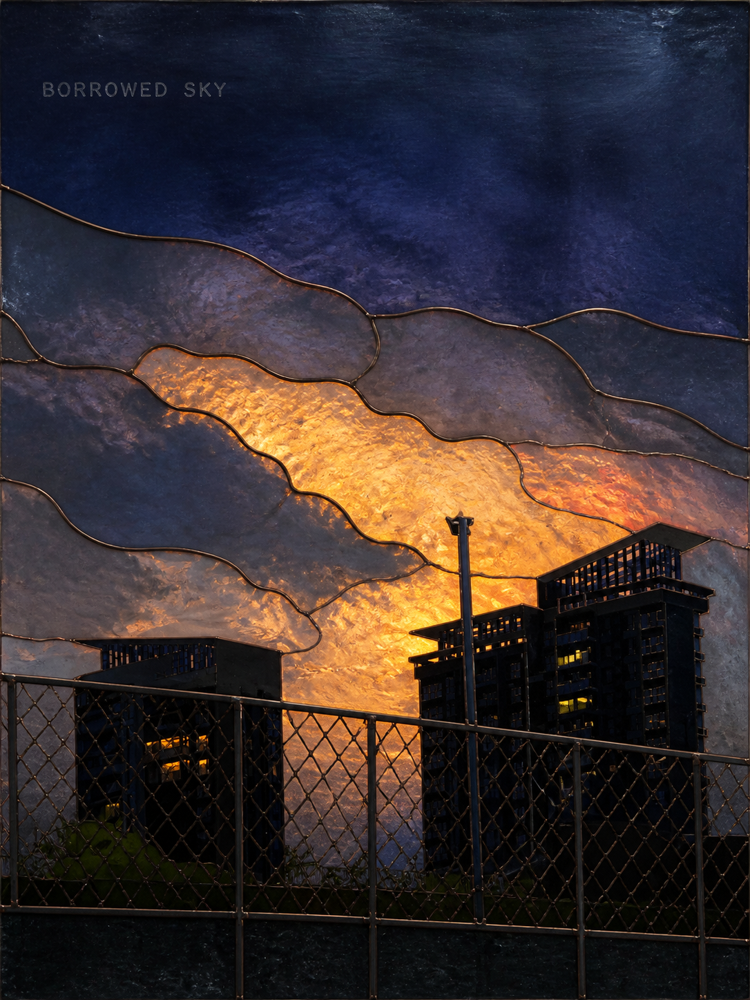

# Example image index

The images in this directory are the example assets selected or generated for this release candidate. Three current visual-language images and one historical image were explicitly approved by the maintainer; the remaining examples are new project assets. The Y2K example was generated from two references explicitly supplied for that purpose. No raw input photos are included.

## Approved current visual languages

### High-Chroma Screenprint

`high-chroma-screenprint-poster` — limited-ink planes, source-derived colour, and controlled registration.

### Kinetic Contour Field

`kinetic-contour-field-poster` — a source-driven contour field that visualizes one real force.

### Mineral Shadow Reliquary

`mineral-shadow-reliquary-poster` — carved dark material with one motivated luminous event.

## Historical visual language

### Chromatic Glass Mosaic (retired)

Historical example only. The corresponding Skill is retired and is not included under `skills/`.

## Additional original Skill examples

The remaining current Skills use clean project-generated example assets. Each file name matches the Skill directory name so the visual relationship is easy to audit.

### Page-Flip Showcase

Static editorial page-turn demonstration composed from repository examples; it is not an animation.

## Complete Skill-to-image mapping

| Skill | Example |
| --- | --- |
| `cinematic-key-art-poster` | [`cinematic-key-art-poster.png`](cinematic-key-art-poster.png) |
| `graphic-composition-poster` | [`graphic-composition-poster.png`](graphic-composition-poster.png) |
| `high-chroma-screenprint-poster` | [`high-chroma-screenprint-poster.png`](high-chroma-screenprint-poster.png) |
| `impossible-space-editorial-poster` | [`impossible-space-editorial-poster.png`](impossible-space-editorial-poster.png) |
| `kinetic-contour-field-poster` | [`kinetic-contour-field-poster.png`](kinetic-contour-field-poster.png) |
| `layered-paper-relief-poster` | [`layered-paper-relief-poster.png`](layered-paper-relief-poster.png) |
| `mineral-shadow-reliquary-poster` | [`mineral-shadow-reliquary-poster.png`](mineral-shadow-reliquary-poster.png) |
| `mixed-media-photo-collage-poster` | [`mixed-media-photo-collage-poster.png`](mixed-media-photo-collage-poster.png) |
| `music-album-cover-art` | [`music-album-cover-art.png`](music-album-cover-art.png) |
| `optical-refraction-visual` | [`optical-refraction-visual.png`](optical-refraction-visual.png) |
| `page-flip-showcase` | [`page-flip-showcase.png`](page-flip-showcase.png) |
| `symbolic-narrative-poster` | [`symbolic-narrative-poster.png`](symbolic-narrative-poster.png) |
| `vintage-offset-cinema-poster` | [`vintage-offset-cinema-poster.png`](vintage-offset-cinema-poster.png) |
| `y2k-street-cutout-poster` | [`y2k-street-cutout-poster.png`](y2k-street-cutout-poster.png) |

## Exclusions

- The image `level-17-show-time.png` is explicitly excluded by the maintainer and is not present here.
- The two failed checkerboard transparency PNGs from the earlier album-cover task are excluded.
- Original user portraits, raw source files, process screenshots, and unapproved archive images are excluded.
